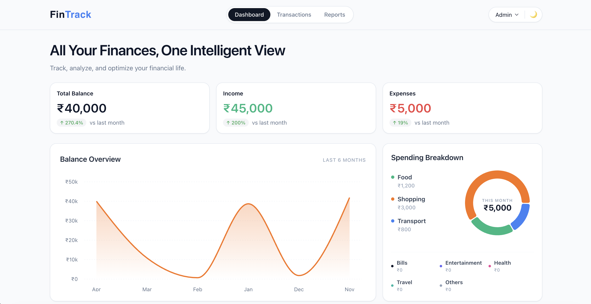
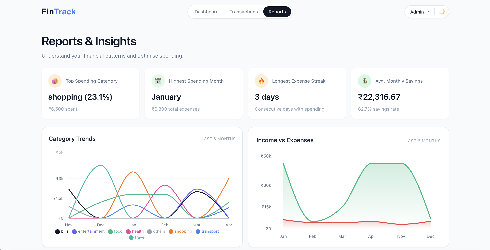
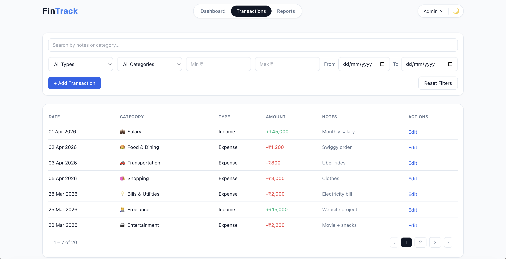

# 💰 FinTrack – Smart Personal Finance Dashboard

## 🚀 Overview
**FinTrack** is a modern personal finance dashboard that helps users track, analyze, and optimize their financial activity. It provides a unified view of income, expenses, savings, and spending patterns through interactive charts and insights.

---

## 🧠 Approach

- **Mock API Layer**: Instead of a backend, all data is fetched through simulated APIs using local JSON files. This helps mimic real asynchronous data flow.
- **Analytics Engine**: Core financial insights (like spending trends, savings rate, and category breakdown) are computed using utility functions.
- **Component-Based Design**: The UI is structured into reusable and modular components (cards, charts, tables) for scalability and maintainability.
- **Feature-Based Structure**: Each major section (Dashboard, Transactions, Reports) is organized as an independent module.
- **State Management**: React hooks (`useState`, `useEffect`, custom hooks) are used to manage data flow and UI updates efficiently.
- **Performance & UX**: Includes skeleton loaders, debouncing, and optimized rendering for smooth user experience.

---

## 📸 Screenshots

### 📊 Dashboard


### 📈 Reports & Insights


### 💳 Transactions


---

## ✨ Feature Breakdown

### 📊 Dashboard
- Displays a summary of:
  - Total Balance
  - Income
  - Expenses
- Monthly **balance trend chart**
- **Spending breakdown** using a donut chart
- Fetches data from mock API

---

### 📈 Reports & Insights
- Automatically generated financial insights:
  - Top spending category
  - Highest spending month
  - Longest expense streak
  - Average monthly savings
- **Category trends chart** (multi-line)
- **Income vs Expense comparison chart**
- Helps users understand financial behavior patterns

---

### 💳 Transactions
- View all transactions in a **paginated table**
- Advanced filtering:
  - Search (notes/category)
  - Type (income/expense)
  - Category
  - Date range
  - Amount range
- **Admin Features**:
  - Add new transactions
  - Edit existing transactions
- Modal-based UI for seamless interaction

---

## 🎨 UI/UX Highlights
- Clean fintech-inspired design  
- Fully responsive  
- Dark mode support  
- Skeleton loading states  
- Interactive charts  

---

## 🧠 Core Concepts
- Data analytics & transformation  
- React hooks & state management  
- Mock API simulation  
- Component-based architecture  
- Data visualization (Recharts)  

---

## 📁 Project Structure
```
fintrack/
├── 📁 src/                      
│   ├── 📁 app/                  
│   │   ├── 📄 App.jsx           
│   │   ├── 📄 main.jsx           
│   │   └── 📄 routes.jsx         
│   ├── 📁 assets/                
│   ├── 📁 components/            
│   │   └── 📁 layout/            # Layout components (Navbar)
│   ├── 📁 constants/             # Global constants (colors, categories)
│   ├── 📁 context/               # React Context Providers (Theme, Role)
│   ├── 📁 data/                  # Mock/Sample data (transactions.json)
│   ├── 📁 features/              
│   │   ├── 📁 dashboard/         # Dashboard logic and charts
│   │   ├── 📁 reports/           # Analytics and insight cards
│   │   └── 📁 transactions/      # Documentation history and tables
│   ├── 📁 hooks/                 
│   ├── 📁 services/              # API interaction layer
│   ├── 📁 styles/                # Global CSS and Tailwind directives
│   └── 📁 utils/                 # Formatting and analytical utilities
├── 📄 eslint.config.js           
├── 📄 index.html                 
├── 📄 package.json               
├── 📄 postcss.config.js          
├── 📄 tailwind.config.js        
└── 📄 vite.config.js             
```
---

## ⚙️ Tech Stack
- Frontend: React + Tailwind CSS
- Charts: Recharts
- State Management: React Hooks
- Data Layer: Mock APIs (simulated backend)

---

## 🌐 Live Demo

👉 [View FinTrack Live](https://fintrack-beta-three.vercel.app/)

---

## 🚀 Getting Started

### Prerequisites

-   **Node.js**: Version 18.0 or higher
-   **Package Manager**: `npm` (v9+)

### Installation

1.  **Clone the Repository**
    ```bash
    git clone https://github.com/rohIta-k/Fintrack.git
    cd Fintrack
    ```

2.  **Install Dependencies**
    ```bash
    npm install
    ```

3.  **Start Development Server**
    ```bash
    npm run dev
    ```

4.  **Open in Browser**
    Navigate to `http://localhost:5173` to view the application.

---
